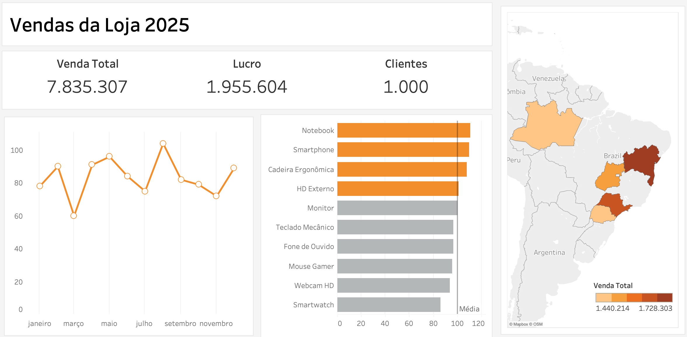

## 📊 Dashboard de Vendas 2025

Este projeto apresenta um **dashboard interativo de análise de vendas** criado no **Tableau**, com base em um dataset simulado de um varejo online.  
O objetivo é visualizar indicadores importantes de performance comercial e comportamento do cliente ao longo de 2025.

---

## 📊 **Visão Geral do Dashboard**

O painel mostra:
-  **Vendas por Produto e Categoria**  
-  **Vendas por Cliente**  
-  **Distribuição por Estado**  
-  **Evolução Mensal das Vendas**  
-  **Indicadores de Performance**
  - Total de Vendas  
  - Ticket Médio  
  - Lucro Total  
  - Crescimento Mensal  
  - Taxa de Conversão  

---

## 🧾 **Fonte de Dados**

- **Arquivo:** `dataset_varejo_online_2025_utf8sig.csv`  
- **Período:** Janeiro a Dezembro de 2025  
- **Campos Principais:**
  - `Data_Venda`
  - `Produto`
  - `Categoria`
  - `Cliente`
  - `Região` (substituída por estados)
  - `Quantidade`
  - `Preço_Unitário`
  - `Venda_Total`
  - `Lucro`
  - `Conversão`

---

## ⚙️ **Ferramentas Utilizadas**

| Ferramenta | Uso |
|-------------|-----|
| **Tableau Public** | Criação do dashboard e visualizações |
| **Excel** | Tratamento e limpeza do dataset |
| **GitHub** | Compartilhamento e versionamento do projeto |

---

## 🚀 **Como Visualizar**

1. Baixe o arquivo **Dashboard-vendas.twbx** deste repositório.  
2. Abra com o **Tableau Desktop** ou **Tableau Public**.  
3. Explore as visualizações interativas e os filtros disponíveis.

> [🔗 **Ver no Tableau Public**]([https://public.tableau.com/](https://public.tableau.com/views/Dashboard-vendas/Painel1?:language=pt-BR&:sid=&:redirect=auth&:display_count=n&:origin=viz_share_link))

---

## 📈 **Insights Esperados**

- Identificar os produtos e categorias com maior volume de vendas e lucro.  
- Analisar o desempenho mensal e sazonal.  
- Avaliar o ticket médio e a lucratividade.  
- Visualizar a concentração geográfica de clientes.  

---

## 👨‍💻 **Autor**

**Luiz Brito**  
📍 São Paulo, Brasil  
📧 [luizbrito09@icloud.com](mailto:luizbrito09@icloud.com)  
🔗 [LinkedIn – luiizbrt](https://www.linkedin.com/in/luiizbrt/)

---

## 🗂️ **Licença**

Este projeto é de uso livre para fins educacionais e de portfólio.  
Sinta-se à vontade para clonar, estudar e adaptar.

---
